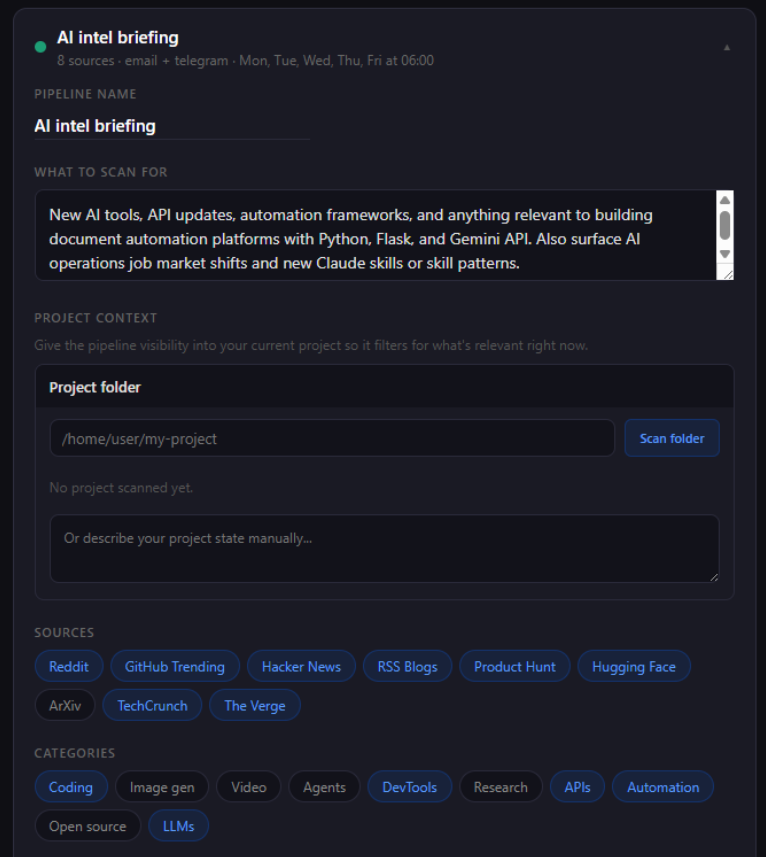
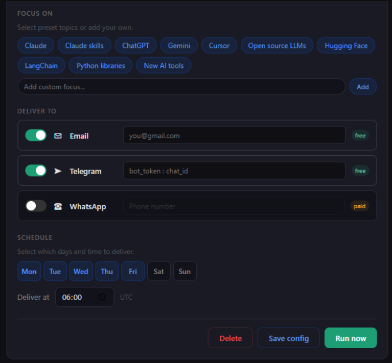
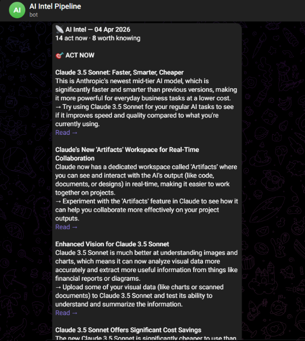
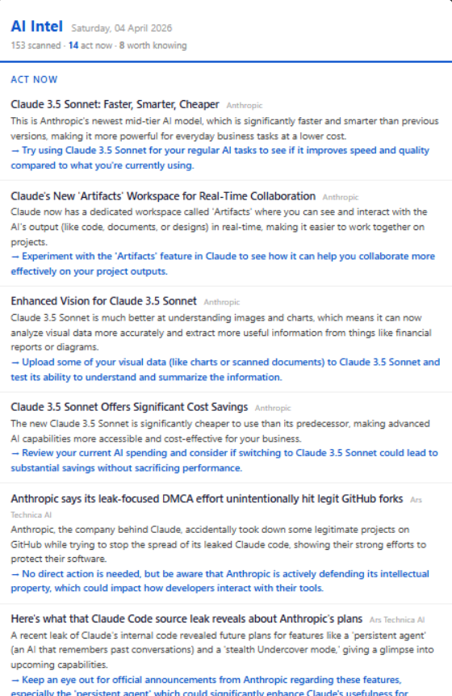

# AI Intel Pipeline

A self-hosted AI intelligence briefing system that scans 15 active feeds daily, filters with Gemini AI, and delivers a ranked digest to your email and Telegram — configured through a web control panel. Three additional high-value publishers are retained in policy as explicitly web-only references and are not claimed as monitored feeds.

---

## How it works

```
┌─────────────────────────────────────────────────────────┐
│                  Active feeds (15)                      │
│  RSS/Atom · GitHub Trending · Hacker News · Reddit Atom │
│  Product Hunt · Hugging Face · TechCrunch · The Verge   │
└───────────────────────┬─────────────────────────────────┘
                        │ raw items (~150/run)
                        ▼
               ┌────────────────┐
               │    Fetcher     │  pipeline_runner.py
               │  RSS / Atom /  │  fetch_rss(),
               │  HTML scrape   │  fetch_github()
               └───────┬────────┘
                        │ canonical IDs · timestamps · source/evidence policy
                        ▼
               ┌────────────────┐
               │  Gemini Flash  │  classify()
               │ Signal Assessor│  Bounded relevance/action/hype signals
               │                │  batched, 25 items at a time
               └───────┬────────┘
                        │ local deterministic ranking and strict tier caps
                        ▼
          ┌─────────────────────────────┐
          │         Delivery            │
          │  ✉  Email (Gmail SMTP)      │
          │  ✈  Telegram Bot API        │
          └─────────────────────────────┘
```

---

## Tech stack

| Layer | Technology |
|---|---|
| Backend | Python 3.12, Flask |
| AI filtering | Google Gemini 2.5 Flash (free tier) |
| Email | Gmail SMTP via `smtplib` |
| Telegram | Telegram Bot API |
| Feed parsing | `feedparser`, `beautifulsoup4`, `requests` |
| Server | Gunicorn + nginx on Ubuntu 24.04 (Hetzner) |
| Auth | Session-based login, credentials from `.env` |
| Config | JSON file, edited live via control panel UI |

---

## Features

- **Web control panel** — dark-mode UI to configure pipelines without touching code
- **Multi-pipeline** — run separate briefings with different sources, topics, and delivery channels
- **Multi-channel delivery** — email and Telegram per pipeline, independently toggled
- **Trustworthy filtering** — canonicalises, freshness-filters, and deduplicates items while preferring primary evidence; Gemini supplies bounded signals and local code computes the final capped ranking
- **Safe trial runs** — `run_single_pipeline(pipeline, deliver=False)` renders and writes a collision-safe audit record without sending email or Telegram
- **Project context** — paste a project description so the AI filters for what's relevant to your current work
- **Run history** — last 14 runs visible in the control panel with item counts
- **Background execution** — "Run now" returns instantly; pipeline runs in a background thread

---

## Setup

### Requirements

- Python 3.10+
- A Gmail account with an [App Password](https://support.google.com/accounts/answer/185833) enabled
- A Telegram bot token (from [@BotFather](https://t.me/botfather)) and your chat ID
- A [Gemini API key](https://aistudio.google.com/) (free tier is sufficient)

### Local development

```bash
git clone https://github.com/YOUR_USERNAME/ai-intel-pipeline.git
cd ai-intel-pipeline

python -m venv venv
source venv/bin/activate        # Windows: venv\Scripts\activate
pip install -r requirements.txt

cp .env.example .env
# Edit .env with your credentials

python app.py
# Visit http://localhost:5000
```

### Server deployment (Ubuntu VPS)

```bash
# On your server
sudo apt update && sudo apt install python3 python3-venv nginx -y

mkdir -p /opt/ai-intel && cd /opt/ai-intel
python3 -m venv venv
source venv/bin/activate
pip install flask gunicorn python-dotenv feedparser requests beautifulsoup4 google-genai

# Copy files
scp app.py pipeline_runner.py user@YOUR_SERVER_IP:/opt/ai-intel/
cp .env.example /opt/ai-intel/.env
# Edit .env with real credentials

# Create systemd service (see DEPLOY.md for full config)
systemctl enable ai-intel
systemctl start ai-intel
```

See [`DEPLOY.md`](DEPLOY.md) for the full nginx and systemd configuration.

### Telegram channel format

In the control panel, enter your Telegram channel value as:

```
BOT_TOKEN:CHAT_ID
```

where `BOT_TOKEN` is the full token from BotFather (e.g. `7123456789:AAHx...`) and `CHAT_ID` is your numeric chat ID. The pipeline splits on the **last** colon, so the colon inside the bot token is handled correctly.

---

## Screenshots

**Control panel — pipeline configuration**


**Delivery settings — email and Telegram**


**Telegram delivery**


**Email delivery**


---

## Key design decisions

### Why Gemini free tier instead of OpenAI?

The classification step runs on ~150 items per pipeline per day. At GPT-4o pricing that adds up quickly. Gemini 2.5 Flash handles structured JSON output reliably on the free tier, keeping the running cost at zero for personal use.

### Why RSS over the X (Twitter) API?

The X API's free tier is not suitable for this daily scan. Active feed sources use unauthenticated RSS/Atom (including Reddit subreddit Atom feeds) or a bounded HTML collector. Anthropic News, the Meta AI Blog, and The Batch currently have no working RSS endpoints, so they remain in the source-policy registry as `web_only` canonical pages and are skipped rather than silently producing fetch errors. Feed hosts can still rate-limit or become unavailable.

### Why Flask instead of Django?

The entire backend fits in two files. Django's ORM, admin, and migrations add complexity with no benefit here — there's no relational data, just a single JSON config file. Flask's minimal surface area also makes the codebase easier to audit and deploy on a fresh VPS in minutes.

---

## License

MIT — see [LICENSE](LICENSE).
